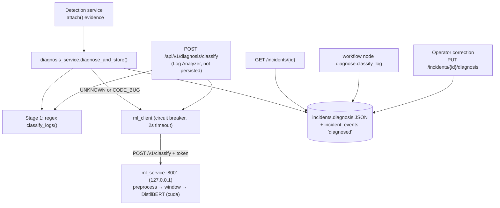

# AI Plan 1: Transformer Log Classifier, GPU ML Service & Hybrid Diagnosis

## 1. Overview

Failure diagnosis today is the deterministic regex classifier in `backend/app/diagnosis/log_classifier.py`
(first-match rules, fixed confidences: 0.95 data-integrity, 0.9 default, 0.7 generic code errors). It is
fast and explainable but returns `UNKNOWN` for unseen formats and over-assigns `CODE_BUG` (its catch-all
rule matches any `ValueError`/`TypeError`, even when the real cause is network or auth).

This plan adds a fine-tuned **DistilBERT sequence classifier** (called "the model" below — not LogBERT,
which is an unsupervised anomaly detector) served from a separate GPU service, used **only where regex is
weak**, with regex remaining the source of truth for automation unless the model is confident.

### Principles
1. **Prove value first.** Build a real-log evaluation set before building the service. If the model does
   not beat regex on real `UNKNOWN`/`CODE_BUG` logs, stop after Phase 1.
2. **Diagnose once, persist it.** A diagnosis is computed when evidence is attached and stored on the
   incident. Page views and workflow runs read the stored value — no model calls on the request path.
3. **Automation only acts on trustworthy categories.** Low-confidence model output is shown as a
   *suggestion*, never used as the category that workflow conditions and retry policy read.
4. **Regex is always the fallback.** ML disabled, down, or not-ready ⇒ behaviour is identical to today.
5. **Operators close the loop.** Operators can correct a diagnosis; corrections become labeled data.

## 2. Categories
Unchanged — the 9 `FailureCategory` values and the `RETRYABLE` set in `log_classifier.py`.
`retryable` is **always** derived in the backend from `RETRYABLE`; the ML service never returns it.

## 3. Architecture



### Hybrid decision rule (`backend/app/diagnosis/hybrid.py`)
Let `r` = regex result (`classify_logs`), `m` = model result, `T = ML_MIN_CONFIDENCE` (default 0.85).
1. If `r.category` not in {`UNKNOWN`, `CODE_BUG`} → return `r` (`source="regex"`). Covers OOM (0.9),
   auth, data integrity, etc. No model call.
2. Else call the model (if enabled and breaker closed). On error → return `r` (`source="regex"`,
   `ml_status="unavailable"`).
3. If `m.confidence ≥ T` and `m.category != UNKNOWN` → final category = `m.category`
   (`source="model"`). A confident model overrides regex `CODE_BUG` because that rule is a generic
   catch-all.
4. Otherwise final category = `r.category`, and `m` is attached as `suggestion` (display only).
5. An operator correction always wins (`source="operator"`) and is never overwritten by re-diagnosis.

Workflow conditions (`diagnosis_categories`) and `retryable` read only the final category — so the model
influences automation only at ≥ T confidence, and that threshold is a single, auditable setting.

### Diagnosis payload (stored + returned)
Extends `Diagnosis` / `DiagnosisRead` (`backend/app/schemas/incident.py:63`):
`category, label, retryable, confidence, rule, matched_line` (existing) plus
`source: "regex"|"model"|"operator"`, `model_version: str|None`, `top_predictions: [{category, score}]`,
`suggestion: {category, confidence}|None`, `ml_status: "used"|"skipped"|"unavailable"|"disabled"`,
`diagnosed_at`. For model results `matched_line` = the highest-signal line from the preprocessor's window
(so the notification summary at `automation_nodes.py:401` still has evidence).

## 4. Directory layout (new/changed only)

```text
backend/
  app/core/config.py                    # + ML_SERVICE_ENABLED=false, ML_SERVICE_URL=http://127.0.0.1:8001,
                                        #   ML_SERVICE_TOKEN, ML_SERVICE_TIMEOUT_SECONDS=2, ML_MIN_CONFIDENCE=0.85,
                                        #   ML_BREAKER_FAILURES=3, ML_BREAKER_COOLDOWN_SECONDS=60
  app/connectors/ml_client.py           # sync httpx client + circuit breaker + secret redaction before send
  app/diagnosis/hybrid.py               # decision rule above (pure; client injected)
  app/services/diagnosis_service.py     # diagnose_and_store(), set_override(); writes 'diagnosed' event
  app/models/incident.py                # + Incident.diagnosis: JSON | None
  alembic/versions/..._incident_diagnosis.py
  app/api/v1/diagnosis.py               # POST /diagnosis/classify (ViewerUser, 256KB cap)
  app/api/v1/incidents.py               # detail reads stored diagnosis; PUT /{id}/diagnosis (OperatorUser+)
  app/services/detection_service.py     # call diagnose_and_store() after _attach() adds TASK_LOG evidence
  app/services/automation_nodes.py      # _classify reads/refreshes stored diagnosis instead of recomputing
  scripts/export_task_logs.py           # dump TASK_LOG evidence + regex/operator label → JSONL for labeling
  tests/test_hybrid_diagnosis.py

ml_service/
  requirements.txt                      # transformers, fastapi, uvicorn, pydantic, scikit-learn (torch from base image / pinned CUDA wheel)
  Dockerfile
  app/{config,main,model,preprocess,schemas}.py
  training/{generate_synthetic,dataset,train,evaluate}.py
  data/eval_real.jsonl                  # hand-labeled real logs (gitignored if sensitive)
  weights/.gitkeep                      # weights gitignored; versioned dirs weights/<version>/
  tests/{test_preprocess,test_api}.py

frontend/src/
  services/endpoints.js                 # + classifyLog, setIncidentDiagnosis
  components/diagnosis/DiagnosisCard.jsx     # badge, confidence, source pill, top-k CSS bars, suggestion, correct-action
  pages/incidents/IncidentDetail.jsx         # render DiagnosisCard
  pages/diagnosis/LogAnalyzer.jsx            # paste log → classify (route /diagnosis/analyzer + nav entry in App.jsx/AppLayout)
```

## 5. Phases

### Phase 1 — Preprocessing, real-log evaluation set, go/no-go (no service yet)
1. **`ml_service/app/preprocess.py`** (shared by training and inference):
   - Strip ANSI codes and Airflow line prefixes (`[timestamp] {file.py:NN} LEVEL -`).
   - Mask volatile tokens: UUIDs, hex ids, IPs, numbers > 3 digits, file paths → placeholders.
   - **Windowing to 512 tokens**: select, in priority order, the last `Traceback` block, lines with
     `ERROR|CRITICAL|Exception|Error:`, then the last 30 lines; dedupe; pack from the tail until the
     token budget is full. Return the window and the top-signal line.
   - Multiple logs per incident: classify each window, pick the highest-confidence non-UNKNOWN.
2. **`backend/scripts/export_task_logs.py`**: export existing `TASK_LOG` evidence with the regex result.
   Hand-label 150–300 logs (prioritise regex `UNKNOWN`/`CODE_BUG`) into `data/eval_real.jsonl`.
3. **`training/generate_synthetic.py`**: 3–5k samples from *templates written per category* (realistic
   Airflow/SQL/boto/requests tracebacks with noise), **not** generated from the regex patterns. Include
   hard cases: `ValueError` raised inside network/auth libraries, nested tracebacks, noisy logs where the
   cause is buried.
4. **`training/train.py`**: fine-tune `distilbert-base-uncased`, HF `Trainer`, AdamW, 3–5 epochs, fp16 on
   CUDA, split by template id to avoid leakage. Include any labeled real logs not in the eval set.
   Save to `weights/<yyyymmdd-hhmm>/` with `model_version.json` (base model, data hash, metrics).
5. **`training/evaluate.py`**: on `eval_real.jsonl`, report per-category P/R/F1 for **regex alone**,
   **model alone**, and **hybrid rule** (at several T values).

**Go/no-go gate:** continue only if on the real eval set the hybrid (a) has overall accuracy ≥ regex,
(b) correctly classifies ≥ 50% of the logs regex marks `UNKNOWN`, and (c) at the chosen T, precision of
model-driven overrides ≥ 0.9. Synthetic-set F1 is reported but not gating.

### Phase 2 — ML service
1. `app/model.py`: load latest `weights/<version>`; `torch.inference_mode()`, device `cuda` if available
   else cpu; `predict(logs: list[str], top_k)` → `{category, confidence, top_predictions, model_version,
   signal_line, device, inference_ms}`. **No zero-shot fallback** — no weights ⇒ `ready=false`.
2. `app/main.py`:
   - `GET /v1/health` → `{ready, model_version, device, vram_used_mb}`.
   - `POST /v1/classify` → requires `X-ML-Token`; body ≤ 256KB; `top_k` ≤ 9.
   - Bind `127.0.0.1` by default (logs can contain secrets).
3. Tests with a stub predictor (no GPU needed in CI): auth required, size cap, not-ready response.

### Phase 3 — Backend integration
1. `ml_client.py`: sync `httpx.Client` (routes and the detection loop are sync), timeout
   `ML_SERVICE_TIMEOUT_SECONDS`; breaker opens after `ML_BREAKER_FAILURES` consecutive failures for
   `ML_BREAKER_COOLDOWN_SECONDS`; logs one warning per open. Redacts `password=`, `token=`, bearer
   headers, connection-string credentials before sending.
2. `hybrid.py`: the decision rule in §3, pure and unit-tested with a fake client.
3. Persistence: `Incident.diagnosis` JSON column + Alembic migration. `diagnosis_service.diagnose_and_store()`
   runs after `detection_service._attach()` when new `TASK_LOG` evidence arrives; skips if
   `source == "operator"`; writes an `incident_events` row `diagnosed` with category/source/version.
   Backfill: on first detail read of an old incident with no stored diagnosis, compute regex-only and store.
4. API: incident detail returns stored diagnosis; `PUT /incidents/{id}/diagnosis {category, note}` records
   an operator override + event; `POST /api/v1/diagnosis/classify` (ViewerUser) for the analyzer,
   not persisted.
5. `automation_nodes._classify`: use stored diagnosis (call `diagnose_and_store` if missing) so the
   workflow and the UI always agree.

### Phase 4 — Frontend
1. `DiagnosisCard.jsx`: category badge, confidence bar, source pill (Regex / Model vN / Operator),
   top-k as plain CSS bars (no chart dependency), "Suggested: X (72%)" line when a suggestion exists,
   evidence line, and a "Correct category" select (operator+ roles).
2. `IncidentDetail.jsx`: card at top of evidence section.
3. `LogAnalyzer.jsx` at `/diagnosis/analyzer`: paste log, see regex result, model result, final hybrid
   decision, and the preprocessed window the model actually saw (this replaces attention-based "token
   highlighting", which is not a reliable explanation).

### Phase 5 — Deployment
- Native run is the primary dev path on Windows: venv with a CUDA torch wheel,
  `uvicorn app.main:app --host 127.0.0.1 --port 8001`.
- Docker (optional, requires WSL2 + NVIDIA GPU support for WSL): pinned current `pytorch/pytorch`
  CUDA 12.x runtime image, don't reinstall torch; weights mounted as a volume; added to
  `docker-compose.yml` under `profiles: ["ml"]` so a plain `docker compose up` needs no GPU:
  ```yaml
  ml-service:
    profiles: ["ml"]
    build: ./ml_service
    ports: ["127.0.0.1:8001:8001"]
    environment:
      ML_SERVICE_TOKEN: ${ML_SERVICE_TOKEN}
    volumes: ["./ml_service/weights:/app/weights"]
    deploy:
      resources:
        reservations:
          devices: [{ driver: nvidia, count: 1, capabilities: [gpu] }]
  ```
- Backend runs on the host, so `ML_SERVICE_URL=http://127.0.0.1:8001` in both cases.

## 6. Acceptance criteria

| Area | Test | Pass |
|---|---|---|
| Value gate | `training/evaluate.py` on real eval set | Go/no-go gate in Phase 1 met |
| Inference | `POST /v1/classify` on GPU, 3×64KB logs | p95 < 100ms, `device` = cuda, valid top-k |
| Hybrid | OOM log | `source=regex`, no ML call made |
| Hybrid | Regex-UNKNOWN log, model conf ≥ T | `source=model`, event `diagnosed` written |
| Hybrid | Model conf < T | category = regex result, `suggestion` populated |
| Consistency | Incident detail vs workflow node | Same stored diagnosis, no ML call on GET |
| Resilience | ML stopped / disabled | Regex result, `ml_status=unavailable|disabled`, no 500s, breaker opens after 3 failures |
| Override | Operator corrects category | Persisted, event logged, not overwritten by new evidence, appears in export |
| Security | Missing token / 300KB body | 401 / 413 |
| Frontend | Incident & Log Analyzer | Card renders all sources; analyzer shows window + decision |

Existing tests (`tests/test_plan2_diagnosis_adapter.py`, automation tests) must still pass with
`ML_SERVICE_ENABLED=false`.

## 7. Checklist
- [x] 1. `preprocess.py` + unit tests
- [x] 2. `export_task_logs.py`; label real eval set
- [ ] 3. Synthetic generator, `train.py`, `evaluate.py` (written); run on GPU → **go/no-go** (training pending)
- [x] 4. ML service (`model.py`, `main.py`, auth, health) + tests
- [x] 5. Backend config, `ml_client.py`, `hybrid.py` + tests
- [x] 6. `Incident.diagnosis` migration, `diagnosis_service`, detection hook, override endpoint
- [x] 7. Update incident detail API and `diagnose.classify_log` node
- [x] 8. Frontend `DiagnosisCard`, IncidentDetail, Log Analyzer route + nav
- [ ] 9. Optional Docker profile (done); end-to-end verification against §6 (pending, needs weights)
