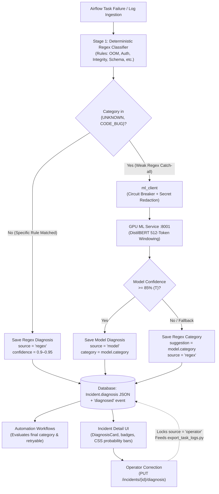

# Hybrid AI Diagnosis System Flowchart

Here is the visual hand-drawn architecture and execution flow for [AI Plan 1](file:///d:/projects/agenticAi/aiplan1.md):

---

## Decision Logic Breakdown

---

## Step-by-Step Flow

1. **Detection & Evidence Attachment**:
   - When a task fails, [detection_service.py](file:///d:/projects/agenticAi/backend/app/services/detection_service.py) attaches `TASK_LOG` evidence and calls `diagnose_and_store()`.
2. **Stage 1 (Regex Classifier)**:
   - [log_classifier.py](file:///d:/projects/agenticAi/backend/app/diagnosis/log_classifier.py) runs high-confidence deterministic rules first.
   - If a specific pattern matches (`AUTH`, `DATA_INTEGRITY`, `SCHEMA`, `RESOURCE`, `TIMEOUT`, `UPSTREAM_MISSING`), diagnosis completes with `source="regex"`. No ML invocation is made.
3. **Stage 2 (ML Service via Circuit Breaker)**:
   - If regex returns `UNKNOWN` or generic `CODE_BUG`, `ml_client` redacts sensitive credentials and calls `POST http://127.0.0.1:8001/v1/classify`.
   - The GPU service extracts the innermost traceback/error window (up to 512 tokens) and runs fine-tuned **DistilBERT** sequence classification.
4. **Hybrid Decision Rule**:
   - **Confidence $\ge 85\%$**: Model overrides generic regex output (`source="model"`).
   - **Confidence $< 85\%$ or ML unavailable**: Falls back to regex category, attaching model prediction as a display-only `suggestion`.
5. **Persistence & Consumers**:
   - The diagnosis is persisted directly on `Incident.diagnosis` JSON column (offline persistence, avoiding model calls on `GET /incidents/{id}`).
   - Workflows read the stored category; operators can manually override and export corrections for ongoing fine-tuning.
