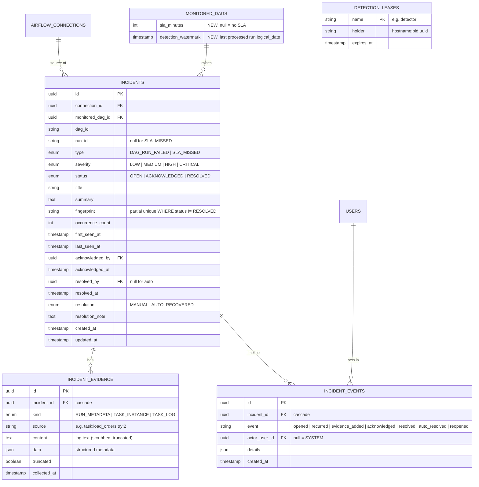

# Plan 1: Failure Detection & Incidents

## 1. Overview & Objective

Plan 0 delivered a registry of monitored DAGs (`monitored_dags.is_monitored = true`), but nothing watches them yet. Plan 1 implements `project.md` MVP steps 2–3:

> 2. Detect task failures, SLA breaches, and basic data-quality failures.
> 3. Store incidents with logs, severity, status, and timestamps.

Target outcome: **a background detector polls Airflow for monitored DAGs, opens deduplicated incidents with evidence (run metadata, failed task instances, task log tails), auto-resolves them when a later run succeeds, and shows them in an Incidents UI where operators acknowledge and resolve them. Every step is audited.**

Scope:

1. **Airflow adapter read-path**: DAG runs, task instances and task logs for Airflow 2.x (`/api/v1`) and 3.x (`/api/v2`), plus mock scenarios.
2. **Incident model**: incidents, typed evidence, a timeline of events, and a detection lease.
3. **Detection engine**: pure, framework-free rules (`app/detection/`) plus a service that runs detection cycles.
4. **Scheduler**: an in-process polling loop with a DB lease so only one worker polls; also a manual "run now" trigger.
5. **Incident API & UI**: list, detail, acknowledge, resolve, reopen; dashboard and header counts; per-DAG SLA settings.

### Out of Scope (deferred)
- Diagnosis (log classification, root cause), remediation recommendations, approvals, and execution: **Plan 2**.
- Data-quality checks (freshness/null/row-count rules on datasets) and other non-Airflow sources.
- Notifications (Slack/email), on-call routing, incident assignment.
- LLM usage of any kind.

### Key Decisions
| Decision | Choice | Rationale |
|---|---|---|
| Incident types | `DAG_RUN_FAILED`, `SLA_MISSED` | These cover "task failures and SLA breaches". Airflow 3 removed native SLAs, so we evaluate SLAs ourselves. |
| SLA definition | Per-DAG `sla_minutes`: breach when the latest **successful** run finished more than `sla_minutes` ago (or there has never been a success within the lookback window) | Freshness-style, and works the same on Airflow 2 and 3. |
| Scheduler | Loop in the FastAPI lifespan; runs sync services in a worker thread (`anyio.to_thread`), reusing `factory.run_async` for adapter calls | No new infrastructure (Celery/Redis). The lease row makes it safe with multiple workers. |
| Dedup | `fingerprint = type:connection_id:dag_id[:run_id]`, partial unique index on open incidents | One open incident per failure. Repeats bump `occurrence_count` and `last_seen_at`. |
| Severity | Deterministic rule function | Explainable and testable, with no ML (per `project.md`). |
| Auto-resolve | A later successful run resolves open incidents for that DAG (`resolution = AUTO_RECOVERED`) | First "verify recovery" hook, which Plan 2 builds on. |
| Evidence | Stored as typed records; log tails capped and scrubbed | Preserves explainability without storing unbounded or sensitive logs. |
| Layering | `app/detection/` has no FastAPI or SQLAlchemy imports | Matches `project.md`: detection is deterministic and independently testable. |

---

## 2. Architecture & Directory Layout (new/changed only)

```text
backend/app/
├── orchestration/airflow/
│   ├── base.py            # + AirflowDagRun, AirflowTaskInstance DTOs; protocol extended
│   ├── client.py          # + list_dag_runs, list_task_instances, get_task_log (v1 + v2)
│   └── mock.py            # + deterministic run/failure/log scenarios
├── detection/             # NEW: framework-free
│   ├── rules.py           # detect_failed_runs, detect_sla_miss, find_recoveries
│   ├── severity.py        # score(finding, context) -> Severity
│   ├── evidence.py        # evidence builders + log scrubbing/truncation
│   └── scheduler.py       # lease-guarded polling loop
├── models/
│   ├── airflow.py         # MonitoredDag + sla_minutes, detection_watermark
│   └── incident.py        # NEW: Incident, IncidentEvidence, IncidentEvent, DetectionLease
├── schemas/incident.py    # NEW
├── services/
│   ├── detection_service.py  # NEW: run_cycle()
│   └── incident_service.py   # NEW: list/get/acknowledge/resolve/reopen
└── api/v1/
    ├── incidents.py       # NEW
    └── detection.py       # NEW

frontend/src/
├── pages/incidents/
│   ├── IncidentList.jsx   # NEW
│   └── IncidentDetail.jsx # NEW
├── pages/settings/MonitoredDags.jsx   # + SLA column
├── pages/dashboard/Dashboard.jsx      # + incidents card, detection status
├── layouts/AppLayout.jsx              # + Incidents nav with open-count badge
└── services/endpoints.js              # + incidentsApi, detectionApi
```

---

## 3. Core Components Breakdown

### 3.1. Airflow Adapter: Read Path

New DTOs in `base.py`:

| DTO | Fields |
|---|---|
| `AirflowDagRun` | `run_id`, `state` (`queued \| running \| success \| failed`), `logical_date`, `start_date`, `end_date`, `run_type` |
| `AirflowTaskInstance` | `task_id`, `state`, `try_number`, `start_date`, `end_date`, `operator` |

Protocol additions and the endpoint mapping:

| Method | Airflow 2.x (`/api/v1`) | Airflow 3.x (`/api/v2`) |
|---|---|---|
| `list_dag_runs(dag_id, since, limit)` | `GET /dags/{id}/dagRuns?execution_date_gte=&order_by=-execution_date` | `GET /dags/{id}/dagRuns?logical_date_gte=&order_by=-logical_date` |
| `list_task_instances(dag_id, run_id)` | `GET /dags/{id}/dagRuns/{run}/taskInstances` | same path under `/api/v2` |
| `get_task_log(dag_id, run_id, task_id, try, max_bytes)` | `GET …/taskInstances/{task}/logs/{try}` with `Accept: text/plain` | same path; JSON `content` (structured events) flattened to text |

- Reuses `_request`, `_check`, `_detect_version` and `_auth_headers`, with the same error mapping (`AirflowAdapterError` carries the `ConnectionStatus`).
- Logs: keep the **tail** up to `max_bytes`. A 404 on a log (e.g. rotated) is not fatal and produces evidence saying the log is unavailable.
- **Mock scenarios** are deterministic from time buckets, so repeated polls behave consistently:
  - `daily_customer_etl`: always succeeds.
  - `orders_pipeline`: every 3rd hourly run fails in task `load_orders` with a realistic Python stack trace (`psycopg.errors.UniqueViolation …`); the next run succeeds, which exercises auto-resolve.
  - `quality_checks`: succeeds.
  - `legacy_inventory_sync`: paused and has had no success for days, so it triggers `SLA_MISSED` when `sla_minutes` is set.

### 3.2. Database Schema



**Incident state machine**

| From | Action | To | Who |
|---|---|---|---|
| `OPEN` | acknowledge | `ACKNOWLEDGED` | Operator+ |
| `OPEN` / `ACKNOWLEDGED` | resolve (note required) | `RESOLVED` (`MANUAL`) | Operator+ |
| `OPEN` / `ACKNOWLEDGED` | later successful run | `RESOLVED` (`AUTO_RECOVERED`) | System |
| `RESOLVED` | reopen | `OPEN` | Operator+ (fails with 409 if another open incident has the same fingerprint) |
| any other | – | 409 `invalid_transition` | – |

A new failure whose fingerprint matches a *resolved* incident opens a **new** incident, so history is preserved.

### 3.3. Detection Engine (`app/detection/`)

**Rules** (pure functions over DTOs, return `Finding` dataclasses):

| Function | Input | Finding |
|---|---|---|
| `detect_failed_runs(runs, watermark)` | runs with `logical_date > watermark` | one `DAG_RUN_FAILED` per failed run |
| `detect_sla_miss(runs, sla_minutes, now)` | all runs in the lookback window | `SLA_MISSED` if the last success `end_date` is older than `now - sla_minutes`, or there is no success |
| `find_recoveries(runs, open_incidents)` | runs plus open incidents for the DAG | incidents to resolve: a success newer than the failure (for `DAG_RUN_FAILED`) or any success within the SLA (for `SLA_MISSED`) |

**Severity** (`score`):

| Signal | Effect |
|---|---|
| Base | `DAG_RUN_FAILED` → `MEDIUM`; `SLA_MISSED` → `LOW` |
| Connection environment is `PROD` | +1 level |
| DAG tagged `tier-1` | +1 level |
| ≥ 3 `DAG_RUN_FAILED` for this DAG in the last 24h | +1 level |
| Cap | `CRITICAL` |

The reasons are stored in `incident_events.details.severity_reasons`, so the score is explainable.

**Evidence** (`evidence.py`):
- `RUN_METADATA`: the run DTO as JSON.
- `TASK_INSTANCE`: every non-success task instance.
- `TASK_LOG`: the log tail for each **failed** task instance (latest try), at most `EVIDENCE_MAX_LOGS` per incident (default 3).
- Scrubbing: regex masks `password=…`, `token=…`, `secret=…`, `Authorization: …`, `postgres://user:pass@`, and similar patterns, using the same key list as `audit_service.redact`. It sets `truncated=true` when a log was cut.

### 3.4. Detection Service & Scheduler

`detection_service.run_cycle(db, *, trigger: "schedule" | "manual", actor)` returns `CycleSummary {connections, dags, opened, recurred, auto_resolved, errors[], duration_ms}`:

1. Load active connections whose monitored DAGs exist.
2. For each connection, build the adapter via `airflow_service._adapter_for`. On `AirflowAdapterError`: store the health using `_store_health`, append to `errors`, and continue with the next connection.
3. For each monitored DAG: fetch runs since `min(watermark, now - DETECTION_LOOKBACK_HOURS)`, apply the rules, then upsert incidents by fingerprint:
   - **new**: insert with evidence plus `opened` and `evidence_added` events, and audit `incident.opened`.
   - **existing open**: bump `occurrence_count` and `last_seen_at`, add a `recurred` event.
4. Apply recoveries: resolve with an `auto_resolved` event and audit `incident.auto_resolved`.
5. Advance `detection_watermark` to the newest processed *terminal* run. Queued and running runs are re-checked on the next cycle.
6. Commit per DAG, so a single bad DAG doesn't roll back the others. Then audit `detection.cycle` with the summary.

`scheduler.py`:
- Lease: `UPDATE detection_leases SET holder=?, expires_at=now+2×interval WHERE name='detector' AND (expires_at < now OR holder = ?)`, inserting the row on first run. Runs only while holding the lease and renews it each cycle.
- Loop: `while not stopped: if acquire(): run_cycle(); await sleep(DETECTION_INTERVAL_SECONDS)`.
- Started and cancelled in the `lifespan` in `app/main.py`. Disabled when `DETECTION_ENABLED=false`, or with `create_app(detection=False)` in tests.
- `POST /detection/run` calls `run_cycle` directly but still takes the lease (a 409 `detection_busy` if another holder is running).
- The last `CycleSummary` is kept in memory on `app.state` for `/detection/status`, and persisted via the `detection.cycle` audit entry.

### 3.5. Configuration (`.env.example` additions)

```env
# Detection
DETECTION_ENABLED=True
DETECTION_INTERVAL_SECONDS=120
DETECTION_LOOKBACK_HOURS=24
EVIDENCE_LOG_MAX_BYTES=65536
EVIDENCE_MAX_LOGS=3
```

### 3.6. API Endpoints

| Method | Endpoint | Description | Access |
|---|---|---|---|
| `GET` | `/api/v1/incidents` | Filters: `status`, `severity`, `type`, `connection_id`, `dag_id`, `search`; newest first; paged | Viewer+ |
| `GET` | `/api/v1/incidents/summary` | Open counts by severity + total open | Viewer+ |
| `GET` | `/api/v1/incidents/{id}` | Incident + evidence + timeline (events with actor names) | Viewer+ |
| `POST` | `/api/v1/incidents/{id}/acknowledge` | `OPEN → ACKNOWLEDGED` | Operator+ |
| `POST` | `/api/v1/incidents/{id}/resolve` | Body `{note}` (1–2000 chars); `→ RESOLVED (MANUAL)` | Operator+ |
| `POST` | `/api/v1/incidents/{id}/reopen` | `RESOLVED → OPEN` | Operator+ |
| `POST` | `/api/v1/detection/run` | Run one cycle now; returns `CycleSummary` | Operator+ |
| `GET` | `/api/v1/detection/status` | Enabled flag, interval, last cycle summary, lease holder/expiry | Viewer+ |
| `PATCH` | `/api/v1/airflow/dags/{id}` | Now also accepts `sla_minutes` (null or 5–10080) | Operator+ |

Audited actions added: `incident.opened`, `incident.acknowledged`, `incident.resolved`, `incident.auto_resolved`, `incident.reopened`, `detection.cycle`, `monitored_dag.sla_update`.

### 3.7. Frontend

- **Sidebar**: an **Incidents** entry with a badge showing the open count (polled with health every 30s).
- **Incidents list**: filter bar (status defaults to open + acknowledged, severity, type, connection, search). Columns: severity pill, title, DAG, type, status, occurrences, last seen. The "Run detection now" button (Operator+) shows the cycle summary as a toast.
- **Incident detail** (`/incidents/:id`):
  - Header: severity, status, DAG link, run id, first/last seen, occurrence count, resolution.
  - Actions (Operator+): Acknowledge, Resolve (a modal with a required note), Reopen.
  - Evidence tabs: *Run* (key/value), *Tasks* (table of failed tasks with try number and duration), *Logs* (monospace scrollable viewer with a copy button and a "truncated" notice).
  - Timeline: events with actor ("System" for automatic ones) and relative time.
- **Monitored DAGs**: an `SLA (min)` column, inline-editable by Operator+.
- **Dashboard**: an "Open incidents" card by severity, and a "Detection" card showing enabled or disabled and the last cycle time and result. A getting-started step "Detection has run at least once" is added.

---

## 4. Implementation Steps & Milestones

Each phase is complete only when its tests pass.

### Phase 1: Adapter Read Path
- [x] DTOs + protocol additions in `base.py`.
- [x] `client.py`: `list_dag_runs`, `list_task_instances`, `get_task_log` (v1/v2, pagination, log tail, v2 structured-log flattening).
- [x] `mock.py`: deterministic scenarios (§3.1).
- [x] Extend `tests/fake_airflow.py` with runs, task instances and logs for both versions.
- **Tests**: parsing for v1 and v2; `since` filter sent with the correct parameter name per version; log truncation keeps the tail; v2 JSON log flattened; log 404 handled; mock scenarios are stable across calls within the same time bucket.

### Phase 2: Data Model & Rules
- [x] `models/incident.py`, `MonitoredDag` columns, Alembic migration (autogenerate, then review).
- [x] `detection/rules.py`, `severity.py`, `evidence.py`.
- **Tests**: migration upgrade→downgrade→upgrade on SQLite (existing `_round_trip` helper); the partial unique index allows one open incident per fingerprint but more than one resolved; rule unit tests (watermark respected, running runs ignored, SLA boundary at exactly `sla_minutes`, no success counts as a breach, recovery matching); severity levels and cap; the scrubber removes secrets and sets `truncated`.

### Phase 3: Detection Service & Scheduler
- [x] `services/detection_service.py` (`run_cycle`), `services/incident_service.py`.
- [x] `detection/scheduler.py` + lifespan wiring + settings.
- **Tests** (against a fake Airflow or a mock connection):
  - A first cycle opens `DAG_RUN_FAILED` with run, task and log evidence.
  - A second cycle doesn't duplicate it; the watermark advances; a recurrence of the same run doesn't create a new incident.
  - A later success auto-resolves it (`AUTO_RECOVERED`, actor SYSTEM).
  - `SLA_MISSED` opens only when the SLA is set and breached, and resolves after a success.
  - An unreachable connection updates `last_health_status`, is reported in `errors`, and other connections still process.
  - Severity escalates for PROD and tier-1.
  - The lease: a second holder can't acquire an unexpired lease, and can after expiry.
  - Audit rows are written for each action.

### Phase 4: Incident & Detection API
- [x] `schemas/incident.py`, `api/v1/incidents.py`, `api/v1/detection.py`, router registration, `sla_minutes` in the DAG patch.
- **Tests**: filters and paging; detail includes evidence and timeline; the state machine (valid transitions, 409 on invalid, reopen conflict); resolve requires a note; Viewer gets 403 on acknowledge, resolve, reopen and run, and can read; `/detection/run` returns a summary and 409 when busy; `sla_minutes` validation and audit.

### Phase 5: Frontend
- [x] `incidentsApi` and `detectionApi` in `services/endpoints.js`.
- [x] `IncidentList.jsx`, `IncidentDetail.jsx`, routes, sidebar badge.
- [x] SLA column on Monitored DAGs; dashboard cards.
- **Tests**: `npm run lint` and `npm run build` clean; the manual browser check in §5.4.

---

## 5. Definition of Done for Plan 1
1. **Tests**: every phase's tests pass; the Plan 0 suite still passes; `ruff` and `oxlint` are clean.
2. **Migrations**: round-trip on SQLite (and PostgreSQL when `TEST_POSTGRES_URL` is set).
3. **Safety**: no secrets in evidence, responses, or audit details; the detector survives Airflow outages without crashing or losing its place (the watermark only advances on success).
4. **End-to-end with a mock connection**: sync DAGs → monitor `orders_pipeline` and `legacy_inventory_sync` (set `sla_minutes = 60`) → run detection → one `DAG_RUN_FAILED` incident with a log tail and one `SLA_MISSED` incident → Operator acknowledges one → a later cycle sees a successful `orders_pipeline` run and auto-resolves it → Operator resolves the SLA incident with a note → the Viewer sees all of it read-only → the timeline and `audit_logs` record every step.
5. **Optional (Docker)**: against Airflow 3 from `docker-compose.yml`, a deliberately failing DAG produces an incident containing the real task log.

**Hand-off to Plan 2**: incidents with evidence become the input to diagnosis (log classification), remediation recommendation (retry / clear task), approval, execution, and verification.

---

## 6. Implementation Notes (as built)

- **Fingerprint** is per DAG (`type:connection_id:dag_id`), not per run. Consecutive failures of the same DAG while an incident is open are recorded as *recurrences* (count, latest run, extra evidence), and the incident closes once a later run succeeds. Each failed run is attached to at most one incident, keyed by its `RUN_METADATA` evidence `source`, so re-polling is idempotent.
- **First cycle for a DAG** (no watermark) does not backfill history: it reports only failures that no later successful run has already recovered.
- **Airflow 2.x logs** arrive as a Python-repr string (`"[('host', 'text')]"`). The adapter decodes it with `ast.literal_eval`. This was found and verified against a real Airflow 2.10.5.
- **Lease TTL** is `max(2 × interval, 60s)`. If a worker dies, another takes over after the TTL. Until then, `POST /detection/run` returns 409 `detection_busy`.
- Incident enums live in `app/detection/types.py`, so the rules and severity code import no SQLAlchemy.
