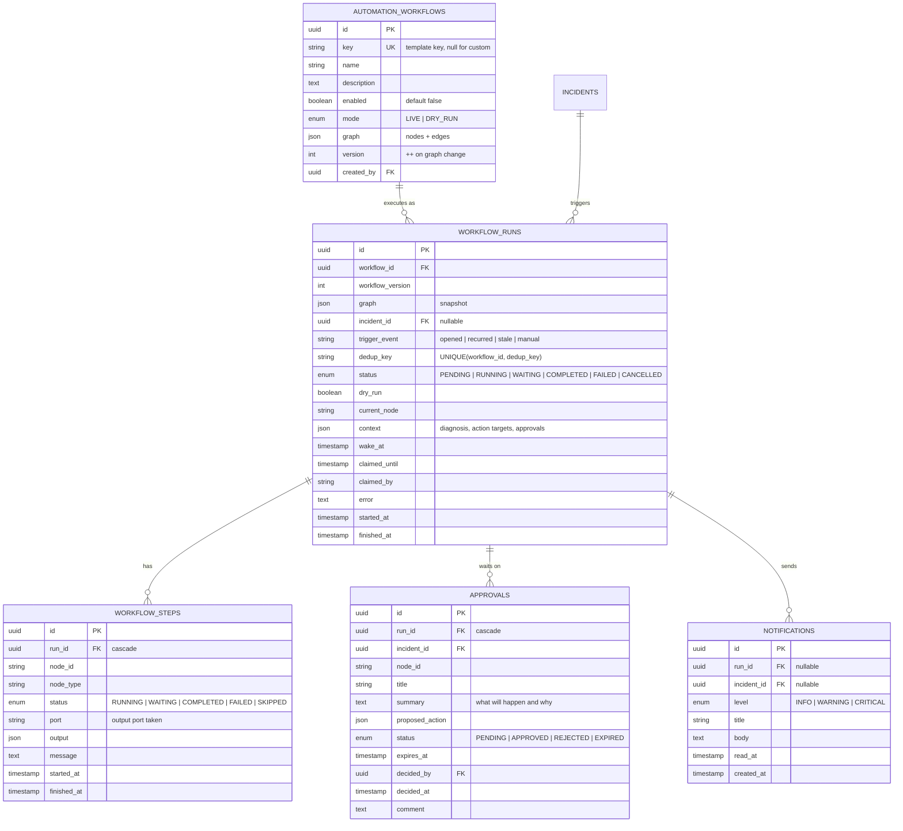

# Plan 2: Automation Workflows (Diagnose → Approve → Act → Verify)

## 1. Overview & Objective

Plan 1 detects failures and SLA breaches and opens incidents with evidence, but everything after that is manual. Plan 2 implements `project.md` MVP steps 4–8:

> 4. Provide a simple diagnosis using logs and recent job metadata.
> 5. Recommend retry or clear-task actions.
> 6. Require approval before execution.
> 7. Execute one safe recovery action.
> 8. Verify job status and selected data-quality checks.

In plain terms: **when a pipeline breaks, the system tries to fix it by itself, safely, and checks that the fix worked.**

Target outcome: **incidents trigger *automation workflows*. A workflow is a small graph of steps ("when X happens, check Y, then do Z"). The steps can classify the failure from its log, ask a human for approval, call Airflow (retry the failed tasks, trigger a run, pause a DAG), verify the result, and update the incident. Every step is policy-checked, recorded and audited.**

Workflows are stored as a JSON graph of nodes and edges. The drag-and-drop canvas (Plan 3) will draw and edit these same graphs, so the canvas needs no new backend model.

Scope:

1. **Diagnosis**: a deterministic log classifier (regex rules, no LLM) that labels failures, e.g. network glitch, timeout, bad data or code bug.
2. **Airflow adapter write path**: clear failed tasks, trigger a DAG run, pause or unpause a DAG, and get a single run (v1 + v2 + mock).
3. **Workflow engine**: workflow definitions (graph), runs, step runs, approvals and notifications; an executor that can wait (for an approval or for a run to finish) and resume.
4. **Node catalog**: trigger, filter, classify, DAG-state check, approval, Airflow actions, verify, incident update, notify.
5. **Policy layer**: PROD actions require an approval, a per-DAG daily action limit, dry-run mode, and an audit record for everything.
6. **Six ready-made workflows (templates)**, seeded disabled on first start.
7. **UI (no canvas yet)**: Approvals, Automation runs, Workflows and Notifications pages; diagnosis and automation on the incident page.

### Out of Scope (deferred)
- The drag-and-drop workflow canvas: **Plan 3**.
- Data-quality checks (row counts, null rates, schema drift) and non-Airflow sources.
- LLM diagnosis, vector search over incident history.
- Slack/email channels (Plan 2 has in-app notifications and a generic webhook).
- Parallel branches inside one workflow run (one active step at a time).

### Key Decisions
| Decision | Choice | Rationale |
|---|---|---|
| Workflow model | JSON graph `{nodes, edges}` with typed nodes and named output ports | Same model the Plan 3 canvas edits; easy to validate and snapshot. |
| Execution | One active node per run; nodes return an output port; waiting nodes set `wake_at` | Simple, resumable, debuggable. No new infrastructure. |
| Where runs start | Detection inserts `PENDING` runs in the same transaction as the incident change; the automation tick executes them | Slow Airflow calls never run inside detection; no lost triggers. |
| Scheduling | The automation tick runs right after each detection cycle, under the same lease; also after an approval decision and on `POST /automation/tick` | Reuses the Plan 1 scheduler and lease. |
| Concurrency | A run is *claimed* with a conditional `UPDATE … WHERE claimed_until < now` before it is advanced | An action can never execute twice, even with several workers. |
| Diagnosis | Regex rules over the scrubbed log tail, first match wins, with a confidence and the matched line | Explainable and testable (per `project.md`, no ML yet). |
| Approval safety | Policy rule, not just graph shape: any Airflow action on a PROD connection is **denied** unless the run holds an approved approval | A badly built workflow cannot bypass approvals. |
| Rate limit | At most `AUTOMATION_MAX_ACTIONS_PER_DAG_PER_DAY` (default 3) executed actions per DAG per 24h | Stops retry loops. |
| Dry run | Per-workflow `mode = LIVE | DRY_RUN`, plus a global `AUTOMATION_FORCE_DRY_RUN` | Try a workflow end to end without side effects. |
| Snapshot | A run stores a copy of the graph it started with | Editing a workflow never changes runs in flight. |
| Resolution | New `IncidentResolution.AUTO_REMEDIATED` | Distinguishes "fixed by automation" from "recovered on its own". |
| Permissions | Admin edits workflows; Operator+ approves/rejects, cancels runs, runs a tick; Viewer reads | Workflows can change production, so authoring is Admin-only. |

---

## 2. Architecture & Directory Layout (new/changed only)

```text
backend/app/
├── diagnosis/                  # NEW: framework-free
│   └── log_classifier.py       # classify(text) -> Diagnosis(category, retryable, confidence, rule, line)
├── automation/                 # NEW: framework-free
│   ├── types.py                # enums: WorkflowMode, RunStatus, StepStatus, ApprovalStatus, ...
│   ├── graph.py                # node catalog (ports + config models), validate_graph()
│   ├── policy.py               # check_action(...) -> PolicyDecision
│   ├── templates.py            # the 6 ready-made workflows
│   └── render.py               # safe {{placeholder}} message templating
├── orchestration/airflow/
│   ├── base.py                 # + get_dag_run, clear_task_instances, trigger_dag_run, set_dag_paused
│   ├── client.py               # + v1/v2 implementations
│   └── mock.py                 # + in-memory write state, new transient-failure DAG
├── models/automation.py        # NEW: Workflow, WorkflowRun, WorkflowStep, Approval, Notification
├── schemas/automation.py       # NEW
├── services/
│   ├── automation_service.py   # NEW: enqueue, tick, advance, approvals, cancel
│   ├── automation_nodes.py     # NEW: one executor function per node type
│   └── detection_service.py    # + enqueue runs on opened/recurred; stale-incident triggers
└── api/v1/automation.py        # NEW

frontend/src/
├── pages/automation/
│   ├── Approvals.jsx           # NEW
│   ├── RunList.jsx, RunDetail.jsx   # NEW
│   ├── Workflows.jsx           # NEW (list, enable, mode, read-only step view)
│   ├── Notifications.jsx       # NEW
│   └── automationUi.jsx        # NEW: badges, labels
├── pages/incidents/IncidentDetail.jsx  # + Diagnosis card, Automation card, new timeline labels
├── layouts/AppLayout.jsx               # + Automation nav section, pending-approval badge
└── services/endpoints.js               # + automationApi
```

---

## 3. Core Components Breakdown

### 3.1. Diagnosis: Log Classifier (`app/diagnosis/log_classifier.py`)

`classify(log_text) -> Diagnosis`. Rules are checked in order and the first match wins. Each rule has a category, a `retryable` flag and a confidence.

| Category | Retryable | Example patterns |
|---|:-:|---|
| `AUTH` | no | `401`, `403 Forbidden`, `authentication failed`, `permission denied`, `invalid credentials`, `expired token` |
| `DATA_INTEGRITY` | no | `UniqueViolation`, `duplicate key`, `violates … constraint`, `IntegrityError`, `ForeignKeyViolation` |
| `SCHEMA` | no | `UndefinedColumn`, `column … does not exist`, `relation … does not exist`, `no such table`, `schema mismatch` |
| `CODE_BUG` | no | `SyntaxError`, `NameError`, `ImportError`, `ModuleNotFoundError`, `AttributeError`, `TypeError`, `KeyError` |
| `RESOURCE` | yes | `MemoryError`, `OOMKilled`, `Killed`, `exit code -9`/`137`, `No space left on device` |
| `TIMEOUT` | yes | `timed out`, `TimeoutError`, `AirflowTaskTimeout`, `deadline exceeded`, `sensor … timeout` |
| `TRANSIENT_NETWORK` | yes | `ConnectionError`, `Connection refused/reset`, `Temporary failure in name resolution`, `502/503/504`, `Service Unavailable`, `too many requests`/`429` |
| `UPSTREAM_MISSING` | yes | `FileNotFoundError`, `NoSuchKey`, `No such file`, `partition … not found`, `upstream … not ready` |
| `UNKNOWN` | yes | nothing matched, or no log available |

- Specific causes are checked before generic ones, e.g. `DATA_INTEGRITY` before `CODE_BUG`, so a `psycopg.errors.UniqueViolation` traceback is `DATA_INTEGRITY` rather than a generic exception.
- `diagnose_incident(evidence)` joins the incident's `TASK_LOG` evidence (newest first) and classifies it. The incident detail API returns this as `diagnosis`. It is computed on read, so older incidents get one too.

### 3.2. Airflow Adapter: Write Path

| Method | Airflow 2.x (`/api/v1`) | Airflow 3.x (`/api/v2`) |
|---|---|---|
| `get_dag_run(dag_id, run_id)` | `GET /dags/{id}/dagRuns/{run}` | same |
| `clear_task_instances(dag_id, run_id, *, only_failed, include_downstream)` | `POST /dags/{id}/clearTaskInstances` `{dag_run_id, only_failed, include_downstream, reset_dag_runs: true, dry_run: false}` | same body |
| `trigger_dag_run(dag_id, *, note)` | `POST /dags/{id}/dagRuns` `{conf: {}, note}` | `{logical_date: null, conf: {}, note}` |
| `set_dag_paused(dag_id, paused)` | `PATCH /dags/{id}?update_mask=is_paused` `{is_paused}` | same |

- Returns: the cleared task IDs, or the new `AirflowDagRun`. Errors map to `AirflowAdapterError` as before. A 409 on trigger (run already exists) is `AIRFLOW_ERROR` with Airflow's message.
- **Mock** keeps its write state in memory (per `base_url`), driven by the mock clock:
  - Clearing a run makes it `running` for 60s, then it ends. Transient-failure DAGs succeed; `orders_pipeline` (a data error) fails again.
  - Triggered runs are `running` for 60s, then `success`.
  - Pause/unpause changes `is_paused` in `list_dags`.
  - New mock DAG **`partner_api_sync`** runs every 10 min. Every 4th run fails in `fetch_partner_orders` with `requests.exceptions.ConnectionError … 503 Service Unavailable` (a transient failure), which exercises the retry workflow.

### 3.3. Database Schema



`INCIDENTS.resolution` gains `AUTO_REMEDIATED`.

**Run state machine**

| From | Event | To |
|---|---|---|
| `PENDING` | tick claims it | `RUNNING` |
| `RUNNING` | a node waits (approval, verify, delay) | `WAITING` (`wake_at` set) |
| `WAITING` | approval decided, or `wake_at` reached | `RUNNING` |
| `RUNNING` | a node's output port has no outgoing edge (end of path, whatever the branch) | `COMPLETED` |
| `RUNNING` | node error, step limit, or incident gone | `FAILED` |
| any non-terminal | Operator cancels | `CANCELLED` (pending approvals → `EXPIRED`) |

### 3.4. Node Catalog (`app/automation/graph.py`)

Each node is `{id, type, name?, config}`. Each edge is `{from, port, to}`. Validation checks:
- exactly one trigger, known types, valid config (Pydantic model per type)
- edges reference existing nodes and valid ports, at most one edge per `(from, port)`
- no cycles, and every node is reachable from the trigger

| Type | Config | Output ports | What it does |
|---|---|---|---|
| `trigger.incident` | `events` (`opened`/`recurred`), `incident_types` | `next` | Starts a run when detection opens or re-records an incident. |
| `trigger.incident_stale` | `minutes` (5–10080) | `next` | Starts a run when an incident stays `OPEN` (unacknowledged) longer than `minutes`. |
| `condition.filter` | `environments`, `incident_types`, `min_severity`, `dag_ids`, `tags_any`, `min_occurrences`, `max_occurrences`, `diagnosis_categories` | `true` / `false` | All set criteria must match. |
| `diagnose.classify_log` | – | `next` | Runs the log classifier; stores `context.diagnosis`; adds a `diagnosed` incident event. |
| `check.dag_state` | – | `ready` / `paused` / `busy` | Asks Airflow whether the DAG is paused or already has a queued/running run. |
| `approval.request` | `required_environments` (default `["PROD"]`, empty = always), `timeout_minutes` | `approved` / `rejected` | Creates an approval and waits. Auto-approves (with a reason) when the environment is not in the list. Timeout → `rejected` (`EXPIRED`). |
| `action.clear_failed_tasks` | `include_downstream` (default true) | `success` / `failed` | Retries the failed tasks of the incident's latest failing run. |
| `action.trigger_dag_run` | – | `success` / `failed` | Starts a new DAG run. |
| `action.set_dag_paused` | `paused` | `success` / `failed` | Pauses or unpauses the DAG. |
| `verify.run_success` | `timeout_minutes` (default 30) | `success` / `failed` | Waits for the run touched by the last action to finish; `success` only if it succeeded. |
| `incident.update` | `operation` (`resolve`/`escalate`/`acknowledge`/`note`), `note` | `next` | Resolves as `AUTO_REMEDIATED`, raises severity one level, acknowledges, or adds a note. |
| `notify` | `channel` (`in_app`/`webhook`), `level`, `title`, `message`, `url` | `next` | In-app notification or JSON webhook. `{{incident.title}}`-style placeholders. Delivery failure is recorded but does not stop the run. |

Every action node goes through the policy check (§3.5) first. If policy denies it, the node takes the `failed` port with `output.policy`.

### 3.5. Policy (`app/automation/policy.py`, pure)

`check_action(action, *, environment, dry_run, approved, actions_last_24h, max_per_day) -> PolicyDecision(allowed, reasons)`

| Rule | Result |
|---|---|
| Connection environment is `PROD` and the run has no approved approval | **deny**: "PROD actions require an approval" |
| `actions_last_24h >= max_per_day` for this DAG | **deny**: "rate limit" |
| Dry run (workflow `DRY_RUN` or `AUTOMATION_FORCE_DRY_RUN`) | allow, but **simulate**: record what would happen; `verify` succeeds without waiting; `incident.update` and webhooks are simulated too |

Every executed or denied action writes an audit entry (`automation.action_executed` / `automation.action_denied`).

### 3.6. Engine (`services/automation_service.py`)

- **`enqueue_for_incident(db, incident, event)`**: for each enabled workflow whose trigger matches, insert a `PENDING` run. `dedup_key` is `{incident_id}:{event}:{occurrence_count}`, so a re-poll never starts the same run twice. It is called by detection inside the same transaction.
- **`tick(db, now)`**:
  1. Enqueue stale-incident triggers (`dedup_key = {incident_id}:stale`).
  2. Expire approvals past `expires_at`.
  3. Claim and advance runs that are `PENDING`, or `WAITING` with `wake_at <= now`.
- **`advance(db, run)`**: loop, running the current node's executor. Each executor returns a `NodeResult(port, output, message, wait_until)`.
  - If the result waits: set the run to `WAITING` and stop.
  - Otherwise: follow the edge for the port. If there is none, the run is `COMPLETED`.
  - Each step commits separately. Guarded by `AUTOMATION_MAX_STEPS_PER_RUN`.
- **Approvals**: `approve`/`reject` records the decision, audits it, adds an incident event, then advances the run immediately.
- Incident timeline events added: `automation_started`, `diagnosed`, `approval_requested`, `approved`, `rejected`, `action_executed`, `action_failed`, `verified`, `verification_failed`, `escalated`, `automation_note`, `automation_finished`.

### 3.7. Ready-made Workflows (`templates.py`, seeded disabled on first start)

| Key | Name | Graph (simplified) |
|---|---|---|
| `retry-transient` | Auto-retry transient failures | incident opened/recurred (run failed) → classify → filter(categories `TRANSIENT_NETWORK`/`TIMEOUT`, occurrences ≤ 2) → approval (PROD only) → clear failed tasks → verify → **resolve** + notify · on failure → escalate + notify |
| `retry-with-approval` | Retry other failures with approval | … → filter(`RESOURCE`/`UPSTREAM_MISSING`/`UNKNOWN`, occurrences ≤ 2) → approval (always) → clear → verify → resolve / escalate |
| `no-retry-data-code` | Don't retry data, code or credential errors | … → filter(`DATA_INTEGRITY`/`SCHEMA`/`CODE_BUG`/`AUTH`) → note "Not retried: …" → notify (warning) |
| `sla-rerun` | Re-run a DAG that missed its SLA | SLA missed opened → check DAG state → *ready*: approval (PROD) → trigger run → verify → resolve · *paused*: notify "DAG is paused" |
| `flapping-breaker` | Stop a DAG that keeps failing | run failed recurred → filter(occurrences ≥ 3) → escalate → notify (critical) → approval (always) → pause DAG → note |
| `stale-escalation` | Remind about ignored incidents | incident open 30 min unacknowledged → escalate → notify |

### 3.8. Configuration (`.env.example` additions)

```env
# Automation
AUTOMATION_ENABLED=True
AUTOMATION_FORCE_DRY_RUN=False          # True = no workflow may change anything
AUTOMATION_MAX_ACTIONS_PER_DAG_PER_DAY=3
AUTOMATION_MAX_STEPS_PER_RUN=50
AUTOMATION_VERIFY_POLL_SECONDS=60
AUTOMATION_WEBHOOK_ALLOWED_HOSTS='[]'   # empty = allow all (dev only)
```

### 3.9. API Endpoints

| Method | Endpoint | Description | Access |
|---|---|---|---|
| `GET` | `/api/v1/automation/node-types` | Catalog: types, ports, config JSON schema (for the Plan 3 canvas) | Viewer+ |
| `GET` | `/api/v1/automation/templates` | Built-in templates | Viewer+ |
| `GET` | `/api/v1/automation/workflows` | List workflows with run counts | Viewer+ |
| `POST` | `/api/v1/automation/workflows` | Create from `{template_key}` or `{name, description, graph}` | Admin |
| `GET` | `/api/v1/automation/workflows/{id}` | Detail incl. graph | Viewer+ |
| `PATCH` | `/api/v1/automation/workflows/{id}` | `name`, `description`, `enabled`, `mode`, `graph` (validated; bumps `version`) | Admin |
| `GET` | `/api/v1/automation/runs` | Filters: `status`, `workflow_id`, `incident_id`; paged | Viewer+ |
| `GET` | `/api/v1/automation/runs/{id}` | Run + steps + approvals | Viewer+ |
| `POST` | `/api/v1/automation/runs/{id}/cancel` | Cancel a non-terminal run | Operator+ |
| `GET` | `/api/v1/automation/approvals` | Filter: `status` (default `PENDING`) | Viewer+ |
| `POST` | `/api/v1/automation/approvals/{id}/approve` | Body `{comment?}`; resumes the run | Operator+ |
| `POST` | `/api/v1/automation/approvals/{id}/reject` | Body `{comment?}`; resumes the run on `rejected` | Operator+ |
| `GET` | `/api/v1/automation/notifications` | Paged; `unread_only` | Viewer+ |
| `POST` | `/api/v1/automation/notifications/read-all` | Mark all read | Viewer+ |
| `GET` | `/api/v1/automation/summary` | Pending approvals, active runs, unread notifications | Viewer+ |
| `POST` | `/api/v1/automation/tick` | Run one automation tick now | Operator+ |
| `GET` | `/api/v1/incidents/{id}` | Now includes `diagnosis` | Viewer+ |

Audited actions added: `workflow.create`, `workflow.update`, `workflow.seed`, `automation.run_started`, `automation.run_finished`, `automation.run_cancelled`, `automation.action_executed`, `automation.action_denied`, `approval.requested`, `approval.approved`, `approval.rejected`, `approval.expired`, `incident.auto_remediated`, `incident.escalated`.

### 3.10. Frontend

- **Sidebar**: an *Automation* section with Approvals (pending badge), Runs, Workflows and Notifications (unread badge). Polled with health every 30s.
- **Approvals**: pending cards showing the incident, diagnosis, proposed action, environment and expiry, with Approve/Reject buttons (optional comment). A history tab for decided approvals.
- **Runs**: a table of workflow, incident, status, trigger, started and duration. **Run detail** shows the step list (node, port taken, message, output) and the approvals.
- **Workflows**: a list with an enabled toggle and mode (Live/Dry run) for Admin, version, and last run. Expanding a workflow shows its steps as a readable list (Plan 3 replaces this with the canvas).
- **Notifications**: a list with level, title, body and incident link, plus "Mark all read".
- **Incident detail**: a *Diagnosis* card (category, retryable, matched line); an *Automation* card (runs for this incident, pending approval with quick approve/reject); timeline labels for automation events.
- **Dashboard**: a "Pending approvals" card.

---

## 4. Implementation Steps & Milestones

### Phase 1: Diagnosis & Adapter Write Path
- [x] `diagnosis/log_classifier.py`; `diagnosis` in the incident detail API.
- [x] Adapter write methods (v1/v2), `FakeAirflow` write endpoints, mock write state + `partner_api_sync`.
- **Tests**: every category with realistic log lines; rule precedence (UniqueViolation → `DATA_INTEGRITY`); empty log → `UNKNOWN`. Clear/trigger/pause/get-run bodies and paths for v1 and v2; mock cleared run goes running → success (transient) / failed (data error); mock trigger and pause.

### Phase 2: Model, Graph & Policy
- [x] `models/automation.py`, `AUTO_REMEDIATED`, Alembic migration.
- [x] `automation/graph.py` (catalog + validation), `policy.py`, `templates.py`, `render.py`.
- **Tests**: migration round-trip; every template validates; validation rejects unknown types, bad config, bad ports, duplicate port edges, cycles, unreachable nodes, zero or two triggers; policy rules (PROD without approval denied, rate limit, dry run).

### Phase 3: Engine
- [x] `automation_service.py` + `automation_nodes.py`; detection enqueues runs; tick after each detection cycle; template seeding at bootstrap.
- **Tests** (mock connection, controlled clock):
  - `retry-transient` in DEV: a failure is classified `TRANSIENT_NETWORK`, cleared, verified after the clock advances, and the incident is resolved `AUTO_REMEDIATED`.
  - The same in PROD: waits for an approval; approve → action → verify; reject → no action.
  - Approval timeout → `EXPIRED` and the `rejected` path.
  - `no-retry-data-code` on `orders_pipeline`: no Airflow write, a note and a notification.
  - `sla-rerun` triggers a run; a paused DAG → notification only.
  - `flapping-breaker` pauses the DAG after approval; `stale-escalation` raises severity.
  - Dry run makes no Airflow writes; the rate limit blocks the 4th action; dedup (re-polling doesn't duplicate runs); a claimed run cannot be advanced twice; cancel; audit rows.

### Phase 4: API
- [x] `schemas/automation.py`, `api/v1/automation.py`, router.
- **Tests**: RBAC (Viewer read-only, Operator approves, Admin edits); graph validation errors return 422 with node/edge details; approve resumes the run; list filters; summary counts.

### Phase 5: Frontend
- [x] `automationApi`; Approvals, Runs, Run detail, Workflows, Notifications pages; incident Diagnosis and Automation cards; sidebar badges; dashboard card.
- **Tests**: `npm run lint` and `npm run build` clean; the manual browser check in §5.4.

---

## 5. Definition of Done for Plan 2
1. **Tests**: every phase's tests pass; the Plan 0 and Plan 1 suites still pass; `ruff` and `oxlint` are clean.
2. **Migrations**: round-trip on SQLite (and PostgreSQL when `TEST_POSTGRES_URL` is set).
3. **Safety**: no Airflow write happens in PROD without an approved approval; no action runs twice; dry run makes no writes; every action, decision and denial is audited; webhook payloads contain no secrets.
4. **End-to-end with a mock connection**: monitor `partner_api_sync` on a DEV connection and enable `retry-transient` → detection opens a failure → the workflow labels it "network glitch", clears the failed task, sees the run succeed and resolves the incident (`AUTO_REMEDIATED`). On a PROD connection it waits in *Approvals* until an Operator approves. `orders_pipeline` failures are *not* retried and produce a notification. Everything shows in Runs, the incident timeline and `audit_logs`.

**Hand-off to Plan 3**: the workflow graph (`nodes`, `edges`, ports) and `/automation/node-types` are the contract for the n8n + draw.io style canvas, where monitor blocks and automation blocks are wired visually.

---

## 6. Implementation Notes (as built)

- **Run status** is `COMPLETED` (not "succeeded") when a path ends, whichever branch it took. The outcome (`context.outcome`, e.g. `approval.rejected` or `notify_ok.next`) tells you which branch it was.
- **Approvals only count when a human gives them.** An approval step that auto-approves (the environment is not in its list, or dry run) does not satisfy the PROD policy. So a workflow whose approval step skips PROD still cannot change a PROD DAG.
- **One active run per workflow and incident.** A recurrence while a retry is in flight does not start a second run. `dedup_key` (`incident:event:occurrence`) makes re-polling safe.
- **Resolved incidents stop runs.** If an incident resolves while a run waits (e.g. detection auto-recovered it), the next tick ends the run before any approval or action step and expires its pending approvals.
- **Claims**: a run is advanced only after a conditional `UPDATE … claimed_until`. An approval decision advances the run in the request thread; if another worker holds it, the next tick resumes it.
- **Diagnosis** is recomputed from evidence when an incident is read, so incidents from before Plan 2 get one too. Log lines shown come from the already-scrubbed evidence.
- **Mock write state** is in memory per base URL (use different base URLs for separate mock connections) and is lost on restart.
- The approvals list accepts `incident_id` (used by the incident page).
